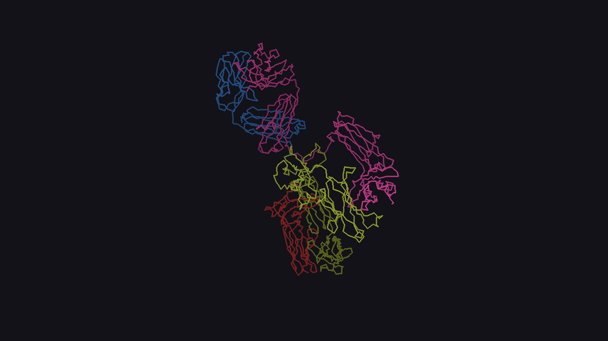

# pdbterm

Terminal protein structure viewer with Unicode braille and Sixel graphics.



*IgG antibody (PDB: 1IGT) rendered in braille mode at 1280x720*

## Installation

```bash
git clone https://github.com/albert-ying/pdbterm.git
cd pdbterm
mkdir build && cd build
cmake ..
make -j$(nproc)
```

Requires CMake 3.15+ and a C++17 compiler. Dependencies (gemmi, lodepng) are fetched automatically.

## Usage

```bash
# Fetch and display a PDB structure by ID
./pdbterm --pdb 1UBQ

# Display a random notable protein
./pdbterm --random

# Load a local PDB/mmCIF file
./pdbterm myprotein.pdb

# Render a PNG screenshot (headless, 1280x720)
./pdbterm --pdb 1IGT --render screenshot.png

# Use Sixel graphics (requires Sixel-capable terminal)
./pdbterm --pdb 1CRN --sixel
```

## Interactive Controls

| Key | Action |
|-----|--------|
| `v` | Cycle view mode (backbone / grid / surface) |
| `c` | Cycle color scheme (rainbow / chain / structure) |
| `p` | Cycle palette (neon / cool / warm / earth / pastel) |
| `WASD` | Pan the view |
| `x` / `y` / `z` | Rotate around axis |
| `r` / `f` | Zoom in / out |
| `Space` | Toggle auto-rotation |
| `n` | Next random structure (in `--random` mode) |
| `q` | Quit |

## PyWal Integration

A separate `pywal` branch adds support for reading terminal colors from `~/.cache/wal/colors`, so pdbterm matches your wallpaper color scheme. Switch to it with:

```bash
git checkout pywal
mkdir build && cd build && cmake .. && make -j$(nproc)
```

## License

GPL-3.0 -- see [LICENSE](LICENSE)
